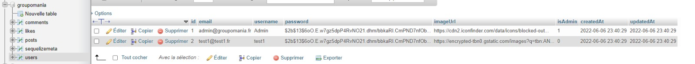
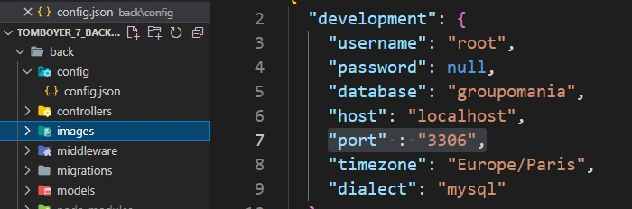
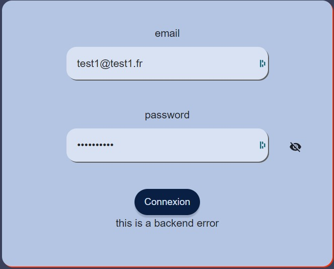

# Welcome to the 7 groupomania project !

  
The project consists of building an internal social network for Groupomania employees. Back + Front

# Tecnhologies utilisées : 

## Back

- NodeJs
- Express
- ORM Sequelize : data Base Mysql
	- (you can view the database from PhpMyAdmin for example)

## Front

- Framework React

# Inititialize

Open 2 terminals

## 1 Back End

Create an .env file at the root of the back and paste : 
- SECRET_TOKEN = mySuperSecretToken 
- SECRET_SALT = "13" 
- USER_PASSWORD = "123Soleil!"

Depending on the local web server used (XAMPP, MAMP, WAMP) change the port used in : 
back > config > config.json

You will find the port used on your computer in the software settings :  
MAMP default port: 8889 
WAMP default port MYSQL: 3306 
WAMP default  MariaDB port: 3307

From root in the first terminal : 
- cd back 
- npm install
- npm run db-init 
	-  which executes a script summarizing : 
		- npx sequelize db:drop : remove a db of the same name if it exists
		- npx sequelize db:create : create db
		- npx sequelize db:migrate : migrate db info/tables
		- npx sequelize db:seed:all :   upload example seeds to db
- nodemon server or node server

## 2 Front End

From root in the second terminal : 
- cd front
- npm i
- npm start
	- a web page should open in your browser
	- if no page opens in the browser you can join the project here:
		http://localhost:3000/

#   Info
## Start
  
At launch you may encounter a server error of this type:

Do not hesitate to restart the back-end part from the first terminal with:
- rs (if you are using nodemon server)
- node server otherwise

## Admin Account
mail : admin@groupomania.fr
password : 123Soleil!

##   Possibilities on the mvp
- signup: create a user in the database
- login: connect with a user already created in the database
- home: display home page with all associated Posts + comments
- create a post
- create a comment under a post
- delete a post if author/admin
<!-- - like a post -->
- edit a post if author/admin
- edit profile: password/username/profile photo
- refresh the page
- return to top of page